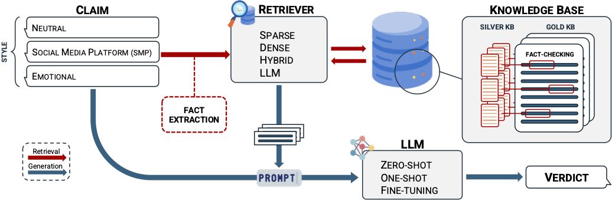

# Face the Facts! Evaluating RAG-based Fact-checking Pipelines in Realistic Settings

This repository contains code and data described in the paper "Face the Facts! Evaluating RAG-based Fact-checking Pipelines in Realistic Settings".

## Experimental Design

This work challenges and refines common assumptions in previous studies on verdict generation by testing various RAG-based pipelines in increasingly realistic scenarios and with different levels of computational complexity. To this end, we present a thorough evaluation of verdict production along the several dimensions that characterize a RAG pipeline. For each dimension, we tested the main available options. In particular, we tested: 

- Three styles of claims that differ in their level of realism: neutral for journalistic claims, SMP for claims that resemble social media platform styles, and emotional whose SMP style is enriched with emotional elements;
- Four different retrieval approaches with varying computational requirements (sparse, dense, hybrid, LLM-based); 
- Two claim pre-processing configurations to better address noise, namely with and without fact extraction; 
- Five LLMs of varying sizes and training characteristics; 
- Three LLM setups: zero-shot, few-shot, and fine-tuned models; 
- Two types of knowledge bases (KB): a gold KB and a silver KB, with or without gold fact-checking articles included, respectively.
- Two document storage strategies in the KB, requiring the retriever to retrieve either entire articles or smaller segments (chunks)



## Citation

If you use this code or data in your research, please cite our paper: 

```bibtex
@inproceedings{russo-2024-face,
  title={Face the Facts! Evaluating RAG-based Fact-checking Pipelines in Realistic Settings},
  author={Russo, Daniel and Menini, Stefano and Staiano, Jacopo and Guerini, Marco},
  year={2024}
}